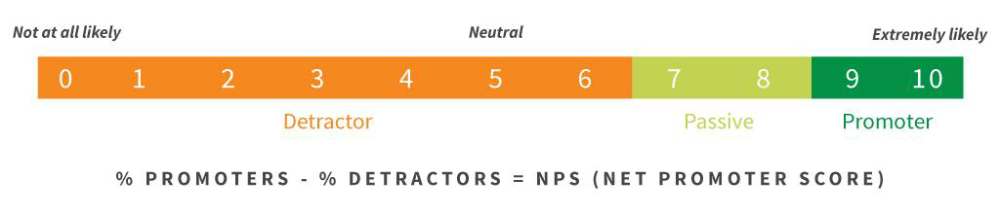
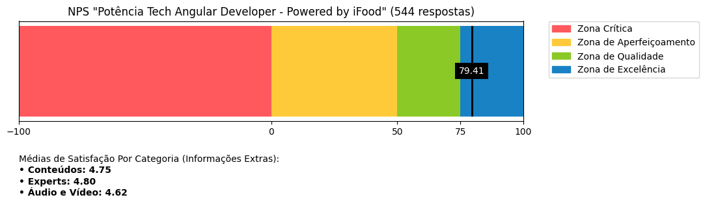
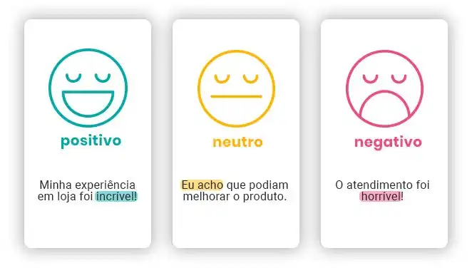

Desvendando a Ifood Dev Week

A Dev Week iFood foi uma série de três lives práticas. Nesse evento exploramos o uso do Python e da Inteligência Artificial (IA), desmistificando a área da Ciência de Dados em um projeto prático para analisar a satisfação dos talentos da DIO em relação às experiências educacionais, utilizando o cálculo do Net Promoter Score (NPS) e a aplicação de IA para analisar sentimentos dos comentários. 

Dia 1: Descubra o poder do Google Colab e Projeto Desta Dev Week!
No primeiro dia, utilizamos o Google Colab, uma plataforma incrível e colaborativa para o desenvolvimento em Python. O Colab facilita a codificação, oferecendo uma plataforma acessível e fácil de usar que não requer instalação. 

Dia 2: Descubra o Poder dos Seus Dados com Python! 
No segundo dia, exploramos o poderoso ETL com Python. Utilizamos bibliotecas essenciais para a manipulação de dados, como Pandas para operações de limpeza e transformação dos dados e matplotlib para a visualização dos dados.

O Pandas nos oferece ferramentas robustas para trabalhar com dados estruturados de maneira eficiente, enquanto matplotlib permite que criemos visualizações de dados eficazes e informativas. Com estas bibliotecas, seremos capazes de extrair, limpar e transformar dados de diferentes fontes de maneira eficaz. Mesmo que não estejamos utilizando diretamente o NumPy em nossos exemplos, é importante mencioná-lo como uma ferramenta fundamental na ciência de dados. O NumPy é a base para muitas bibliotecas de ciência de dados em Python, incluindo Pandas e matplotlib, oferecendo suporte para arrays e matrizes, além de funções matemáticas para operações com esses tipos de dados.

Importamos dados, limpamos conjuntos de dados desorganizados, lidamos com valores ausentes, convertemos tipos de dados e criamos visualizações atraentes, transformando dados brutos em um formato adequado para análise e tomada de decisão. 

Dia 3: Decifrando Sentimentos com Inteligência Artificial (IA) 
No terceiro dia, aplicamos algoritmos avançados para decifrar os sentimentos e as emoções presentes nos textos com base nos comentários e feedbacks dos participantes. 

A análise de sentimentos é uma técnica que nos permite ir além dos números e estatísticas, fornecendo um olhar qualitativo sobre as percepções e opiniões das pessoas. Isso pode nos gerar insights únicos e profundos sobre suas experiências, ajudando-nos a moldar e melhorar nossas iniciativas educacionais.

